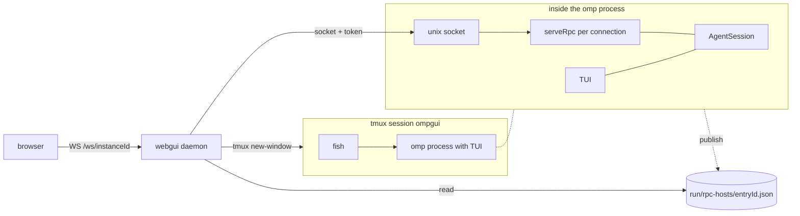
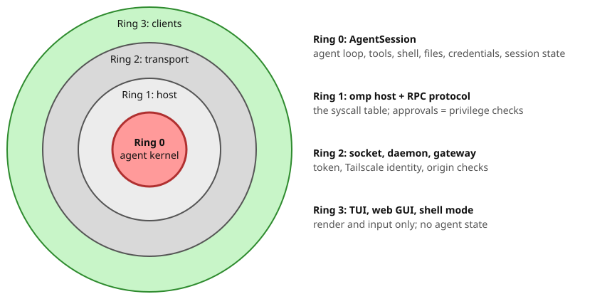

# Session host: one session, three surfaces

This is a design for the fork only. Status: sections 1 and 2 are implemented. `omp host start` runs a headless host with one lock per session (`pid:startTime`, stale on pid reuse), a registry entry with `kind: "host"`, and idle exit (`rpc.hostIdleTimeoutMs`); the webgui launches sessions through it instead of tmux. The host owns one goal controller for its lifetime and continues goals with no client connected; active goals, pending extension requests, and pending plan reviews keep it alive. It ignores `plan.defaultOnStartup` and restores plan mode on resume. A swap to a session that another host holds is refused with `{cancelled: true, movedTo}`. Registry readers probe the socket before they trust or remove an entry. A TUI takes the session lock only when `rpc.serve` is on. Section 6 is partly done. The TUI does not attach to a host yet. The shell client is not built yet.

## Goal

The user uses one omp session from three surfaces:

| Surface | Description | Sync |
|---|---|---|
| TUI | `omp` in a terminal. This is the default. | live |
| web | `packages/webgui` on a phone or desktop. | live |
| shell | Shell mode client. The user types `?` in the shell. Giverny (`~/Code/giverny`) was an earlier iteration. | none |

Rules:

- Each surface can start a session.
- Each surface can resume a session that a different surface started.
- TUI and web show all events. They stay in sync with each other.
- Shell mode shows only the output of its own turns.
- When TUI or web acts on a session, the shell pane detaches. Nothing from other surfaces goes to the shell.

Example:

1. The user starts a session on the phone.
2. In tmux, the user splits a pane and types `? /a`.
3. The user selects the session from a list.
4. The user sends prompts with `?`.
5. Later, the user opens the session in the TUI. The shell pane detaches.
6. The phone shows the full transcript at all times.

## System before the host (before `b8f40af213`)

This design changes the facts that follow. Paths are in `packages/coding-agent/src/modes/rpc/` if no other path is given.

- Only the TUI serves RPC. `RpcServeController` connects the socket server to the `AgentSession` of the TUI (`rpc-serve-controller.ts:55`).
- `omp --mode rpc` uses stdio. It has one client. It stops when its input closes (`rpc-mode.ts`).
- Socket clients have fewer rights than the TUI:
  - Extension UI dialogs stay in the TUI. The socket path does not install `onReady` (`rpc-socket.ts:70-82`).
  - Only the TUI reattaches goals (`ownsSession:false`, `rpc-socket.ts:79`).
  - RPC `shutdown` stops the full TUI process (`rpc-serve-controller.ts:58`).
- The registry identifies processes, not sessions:
  - Web routes use `instanceId`. Each process has one `instanceId` (`rpc-registry.ts:183`).
  - `sessionId` changes in a process on `/new`, `/resume`, and `/fork` (`agent-session.ts:5313`).
- To check liveness, the reader of the registry sends `kill(pid,0)`. No process checks that the socket answers (`rpc-registry.ts:263-313`).
- To start a session, the daemon runs `tmux new-window -- fish -C 'omp ...; exit'`. Then it finds the new process by cwd and time (`packages/webgui/src/server/launch.ts:37-54`).
- More than one client can use one session now. Each connection subscribes to the same `AgentSession` (`rpc-server.ts:1672`). The only control is `AgentBusyError` (`rpc-server.ts:1869`).

## Design

### 1. Headless host

A host is an omp process. It holds one `AgentSession`, serves the socket protocol, and has no UI. The host owns these items:

- the agent loop
- tools
- the queue
- approvals
- the session file

Rules:

- Each surface can start a host with `omp host start [--resume <sessionId>] [--cwd <path>]`.
- The command returns `{instanceId, sessionId, endpoint, pid, reused}` as JSON.
- The host runs in its own process group. It has no controlling terminal. It does not run in tmux.
- The host owns extension UI, goals, and plan mode. A TUI that is not attached to a host still owns them in its own process.
- The host sends UI requests to clients (section 5).

### 2. Identity and registry

The registry identifies host processes by `instanceId`. Each entry carries the `sessionId` the host holds now.

- One host holds one session at a time.
- When the host swaps session, it rewrites `sessionId` in its entry.
- If a host holds the session, `omp host start` returns that host. It does not start a second host.
- Before the host creates its socket, it gets an exclusive lock for the session. Thus two starts at the same time make one host.
- The entry contains `instanceId`, `sessionId`, `pid`, `endpoint`, `token`, `cwd`, `sessionFile`, `model`, and `startedAt`.
- Before a reader trusts or removes an entry, it checks the pid and connects to the socket.
- `/new`, `/fork`, and `/resume` change the session of the host in place. This is current behavior: `/n` in the TUI moves the web client on every device to the new session.
  - Thus routes stay keyed by `instanceId`. `sessionId` is not a stable address for a live host.
  - A session that the host leaves has no live host. A surface starts one with `--resume`.
  - If another live host holds the target session, the host does not swap. The client that sent the command moves to that host. The first host and its other clients do not change.

### 3. Clients

| | TUI | web | shell |
|---|---|---|---|
| Connection | persistent | persistent, through the daemon | one for each `?` command |
| Events | all | all | own turn only |
| Can start a host | yes | yes, through the daemon | yes, with `? /n` |
| When another surface acts | continues | continues | detaches |

TUI:

End state, built last (open question 4):

- `omp` with no arguments connects to a host or starts one.
- `omp --resume <id>` connects to the live host if it exists.
- The TUI shows protocol events. It does not hold an `AgentSession` in its process.
- This is the largest change. It is the main risk for merges from upstream.

Web:

- The daemon does not use tmux. It runs `omp host start`.
- Routes use `instanceId`.

Shell (rough; details are settled while the shell client is built):

- The shell client keeps the `instanceId` of the attached host for each pane. The key is `$TMUX_PANE`, or the tty if there is no tmux.
- `? /a` reads the live hosts from the registry. The user selects one.
- `? /n [<prompt>]` runs `omp host start --cwd <pane cwd>`, attaches the pane to the new host, and sends `<prompt>` if given.
- A bare `?` never starts a host. If the pane has no attachment, or its host is gone, `?` prints "no session attached" and does not send the prompt. The user attaches with `? /a` or starts a host with `? /n`.
- Each `?` command connects, sends `prompt`, prints the output of that turn, and disconnects.
- The picker reads and draws on `/dev/tty`, the user's terminal, so it works when stdin or stdout is a pipe.
- A `?` with piped stdin reads stdin to EOF before it checks its attachment. Thus in `? a | ? b`, only `? a` can open the picker; `? b` then finds the pane attached to the host that `? a` picked.

### 4. Driver and shell detach

Each host records the surface that acted last: `driver: {surface, clientId}`.

- These commands set the driver: prompt, steer, abort, and session commands.
- When the driver changes from a shell client to a different client, the host cancels the shell attachment.
- The shell client is not connected between commands. Thus the next `?` finds the cancellation:
  1. It prints one line that tells the user that the pane is detached.
  2. It holds the prompt.
  3. It opens the `? /a` picker by itself. After the user picks a session, it sends the held prompt there.
- `? /a <prompt>` opens the picker, attaches the pane to the selected session, and sends `<prompt>` to it. Without `<prompt>`, it only attaches. The picker lists live hosts only; it does not resume past sessions.
- A driver change does not detach TUI or web clients. They show live data only.
- The host sends a `driver_changed` event. `get_state` includes the driver.
- Why the shell detaches: a shell pane prints only its own turns. Mirroring turns driven from the phone or TUI into the pane is awkward, so the pane stops instead.

### 5. Interactive requests

The host sends approvals, ask dialogs, and extension UI to the current driver.

- If the driver is a shell command, the shell client shows the request in the shell.
- If no applicable client is connected, the request waits for one.
- When the driver changes, pending requests move to the new driver. Example: an approval waits in a shell pane; the user prompts from the phone; the approval now shows on the phone.
- The host never approves a request automatically.

### 6. Lifetime

- A detach does not stop work. The host continues while a turn, tool, subagent, queue, retry, compaction, or pending interactive request (approval, ask, extension UI) is active.
- Idle exit: if no client is connected and no work is active for a set time, the host does these steps:
  1. It writes the session file.
  2. It removes its registry entry and socket.
  3. It stops.
- The session file holds the durable state. If the host stops unexpectedly, web or the TUI can start a new host with `--resume`.
- `shutdown` stops the host. It does not stop client processes.

## Open questions

1. **Where do shell-mode tools run?** Decided: in ring 0, the `AgentSession` of the host, as for every other client. Giverny does not supply tools (`set_host_tools` is not used for this).
   - Decided: the host keeps its own cwd and controls it. A `?` turn tells the agent the cwd of the user's pane as context. The agent decides whether to act there; tools do not move to the pane.
   - Cost, accepted: a shell pane attaches to one host at a time.
2. **Pipes.** Decided, example `? tell me a poem | ? what do you think of this poem`:
   - stdout of a `?` command carries only the final assistant text of its turn.
   - If stdin is a pipe, `?` reads it to EOF and adds it to the prompt of its turn. Thus the second turn starts after the first ends, on the same host.
3. **Phone as driver.** Decided: a prompt from the phone or TUI detaches the shell pane (section 4). The next `?` prints the detach line, opens the picker, and sends its prompt to the picked session, as `? /a <prompt>` does.
4. **TUI client scope.** Decided: the end state is a pure TUI client, equal to web and shell. It is built last, after host, web, and shell. Until then the TUI keeps its own `AgentSession`.
5. **Transport.** Decided: local clients use the Unix socket; the daemon relays for web over HTTP and WebSocket, as now. QUIC is a possible later redesign of the web connection only.
6. **Status on the terminal.** Upstream OSC 7501 support (`fd84fae07c`, `src/utils/run-status.ts`, setting `terminal.programStatus`) is in the fork. Only the TUI reports it, to its own terminal. Decided: the fork does not extend it; complete support for hosts and clients is left to the omp maintainers.
7. **Host per session or per project.** Decided: one host per session. A project is a folder; it does not own a host.

## Rings model

| Ring | Name | Owns |
|---|---|---|
| 0 | Agent kernel | agent loop, model access, tools, shell, file system, session state, approval policy, credentials |
| 1 | Host | `omp host` process; speaks the RPC protocol |
| 2 | Transport | Unix socket and token, webgui daemon relay, future tailnet gateway |
| 3 | Clients | TUI, web GUI, shell mode; render and input only |

Rules:

- The protocol is the contract. Code inside a ring can change, including an upstream rewrite of ring 0, as long as the boundary holds.
- Clients keep no agent state. Credentials never leave ring 0.
- Approval decisions and enforcement are in ring 0. Only the human answer comes from a client.
- Plan mode and goals change agent behaviour, so ring 0 owns them. The TUI owns them today.
- Test for the kernel: if two clients would disagree when each kept its own copy, the state belongs in ring 0.

## Decisions and direction

- **No full fork yet.** Upstream owns ring 0. The fork owns rings 1 to 3 and the protocol between them. Fork changes stay mostly additive so that rebases stay cheap. Fork clients use the protocol, not coding-agent internals.
- **From Pi Durable, take the attach model, not commit-everything.** Take: a snapshot of the current view on attach, then only changes; a `requestId` on prompts so that retries are safe. Do not take: commit every step to storage before showing it. The cost in latency and tool replay rules is too high for this fork. The accepted loss is that a host crash loses the turn in progress; the session file is still durable.
- **TUI as a client.** End state: the TUI is a pure client like web and shell. It holds no `AgentSession` and talks to a host over the protocol. The direction is the Copilot one: a local host over an in-memory transport, so attaching to a remote host is only a change of transport. Timing depends on the upstream direction.
- **Remote agents.** Hosts run on a laptop, a cloud machine, or other infrastructure on the tailnet. Local clients attach through a per-machine gateway that checks the `Tailscale-User-Login` identity header and maps it to a role. Tools run on the host machine.

## Out of scope

- Remote attach without the daemon. Collab already gives remote sharing.
- More than one session in one host.
- Changes to the stdio behavior of `omp --mode rpc`.

## References

- Giverny plan, the earlier shell iteration (one service per project; superseded by this doc): `~/Code/giverny/plans/omp-first-class-shell.md`.
- Protocol v3: `packages/webgui/PIPELINE.md`.
- Migrating the GitHub Copilot runtime to Rust (TUI layered on the runtime, one JSON-RPC protocol in-process and out-of-process): https://github.blog/ai-and-ml/generative-ai/migrating-the-github-copilot-runtime-to-rust-using-copilot/
- OSC 7501 rationale: https://mitchellh.com/writing/program-status-osc7501
- OSC 7501 spec: https://www.superlogical.com/rex/docs/build/program-status
- Pi Durable (one owner process, clients attach, snapshot then changes, `requestId`): https://earendil.com/posts/pi-durable/ and https://github.com/earendil-works/pi/blob/main/packages/durable/README.md
- Tailscale Serve identity headers (`Tailscale-User-Login`; absent for tagged devices and Funnel): https://tailscale.com/docs/features/tailscale-serve.md
