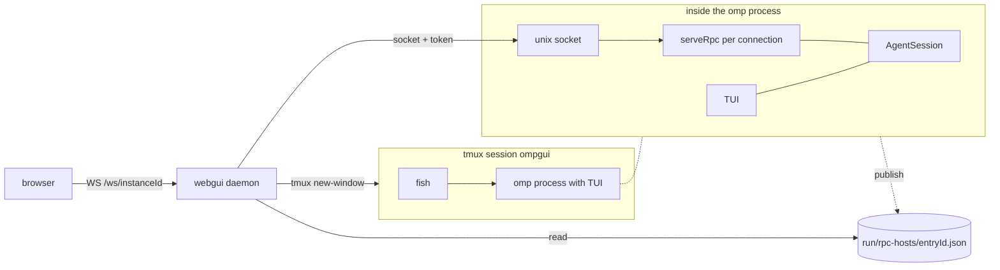

# Session host: one session, three surfaces

This is a design for the fork only. Status: draft for review. Nothing is implemented.

## Goal

The user uses one omp session from three surfaces:

| Surface | Description | Sync |
|---|---|---|
| TUI | `omp` in a terminal. This is the default. | live |
| web | `packages/webgui` on a phone or desktop. | live |
| shell | Giverny (`~/Code/giverny`). The user types `?` in the shell. | none |

Rules:

- Each surface can start a session.
- Each surface can resume a session that a different surface started.
- TUI and web show all events. They stay in sync with each other.
- Shell mode shows only the output of its own turns.
- When TUI or web acts on a session, the shell pane detaches. Nothing from other surfaces goes to the shell.

Example:

1. The user starts a session on the phone.
2. In tmux, the user splits a pane and types `? /a`.
3. The user selects the session from a list.
4. The user sends prompts with `?`.
5. Later, the user opens the session in the TUI. The shell pane detaches.
6. The phone shows the full transcript at all times.

## Current system

This design changes the facts that follow. Paths are in `packages/coding-agent/src/modes/rpc/` if no other path is given.

- Only the TUI serves RPC. `RpcServeController` connects the socket server to the `AgentSession` of the TUI (`rpc-serve-controller.ts:55`).
- `omp --mode rpc` uses stdio. It has one client. It stops when its input closes (`rpc-mode.ts`).
- Socket clients have fewer rights than the TUI:
  - Extension UI dialogs stay in the TUI. The socket path does not install `onReady` (`rpc-socket.ts:70-82`).
  - Only the TUI reattaches goals (`ownsSession:false`, `rpc-socket.ts:79`).
  - RPC `shutdown` stops the full TUI process (`rpc-serve-controller.ts:58`).
- The registry identifies processes, not sessions:
  - Web routes use `instanceId`. Each process has one `instanceId` (`rpc-registry.ts:183`).
  - `sessionId` changes in a process on `/new`, `/resume`, and `/fork` (`agent-session.ts:5313`).
- To check liveness, the reader of the registry sends `kill(pid,0)`. No process checks that the socket answers (`rpc-registry.ts:263-313`).
- To start a session, the daemon runs `tmux new-window -- fish -C 'omp ...; exit'`. Then it finds the new process by cwd and time (`packages/webgui/src/server/launch.ts:37-54`).
- More than one client can use one session now. Each connection subscribes to the same `AgentSession` (`rpc-server.ts:1672`). The only control is `AgentBusyError` (`rpc-server.ts:1869`).

## Design

### 1. Headless host

A host is an omp process. It holds one `AgentSession`, serves the socket protocol, and has no UI. The host owns these items:

- the agent loop
- tools
- the queue
- approvals
- the session file

Rules:

- Each surface can start a host with `omp host start [--resume <sessionId>] [--cwd <path>]`.
- The command returns `{sessionId, endpoint}` as JSON.
- The host runs in its own process group. It has no controlling terminal. It does not run in tmux.
- The host owns extension UI, goals, and plan mode. The TUI owns these items now.
- The host sends UI requests to clients (section 5).

### 2. Identity and registry

The registry identifies sessions, not processes.

- The key is `sessionId`.
- One host serves one session.
- If a host for the session exists, `omp host start` returns that host. It does not start a second host.
- Before the host creates its socket, it gets an exclusive lock for the session. Thus two starts at the same time make one host.
- The entry contains `sessionId`, `pid`, `endpoint`, `token`, `cwd`, `sessionFile`, `model`, `startedAt`, and `status`.
- `status` uses the OSC 7501 states: `idle`, `working`, `blocked` (with `kind`), `done`, `error`. Session lists can show the state without a connection to the host.
- Before a reader trusts or removes an entry, it checks the pid and connects to the socket.
- `/new` and `/fork` start a new host for the new session. A host does not change its `sessionId`.
  - OPEN: Alternatively, the host changes session and the registry key moves. A fixed identity is easier for all clients.

### 3. Clients

| | TUI | web | shell |
|---|---|---|---|
| Connection | persistent | persistent, through the daemon | one for each `?` command |
| Events | all | all | own turn only |
| Can start a host | yes | yes, through the daemon | yes |
| When another surface acts | continues | continues | detaches |

TUI:

- `omp` with no arguments connects to a host or starts one.
- `omp --resume <id>` connects to the live host if it exists.
- The TUI shows protocol events. It does not hold an `AgentSession` in its process.
- This is the largest change. It is the main risk for merges from upstream.

Web:

- The daemon does not use tmux. It runs `omp host start`.
- Routes use `sessionId`, not `instanceId`.

Shell:

- Giverny keeps the attached `sessionId` for each pane. The key is `$TMUX_PANE`, or the tty if there is no tmux.
- `? /a` reads the hosts from the registry. The user selects one.
- Each `?` command connects, sends `prompt`, prints the output of that turn, and disconnects.

### 4. Driver and shell detach

Each session records the surface that acted last: `driver: {surface, clientId}`.

- These commands set the driver: prompt, steer, abort, and session commands.
- When the driver changes from a shell client to a different client, the host cancels the shell attachment.
- The shell client is not connected between commands. Thus the next `?` finds the cancellation:
  1. It prints one line that tells the user that the pane is detached.
  2. It does not send the prompt.
  3. The user types `? /a` to attach again.
- A driver change does not detach TUI or web clients. They show live data only.
- The host sends a `driver_changed` event. `get_state` includes the driver.

### 5. Interactive requests

The host sends approvals, ask dialogs, and extension UI to the current driver.

- If the driver is a shell command, Giverny shows the request in the shell.
- If no applicable client is connected, the request waits for one.
- The host never approves a request automatically.

### 6. Lifetime

- A detach does not stop work. The host continues while a turn, tool, subagent, queue, retry, or compaction is active.
- Idle exit: if no client is connected and no work is active for a set time, the host does these steps:
  1. It writes the session file.
  2. It removes its registry entry and socket.
  3. It stops.
- The session file holds the durable state. If the host stops unexpectedly, each surface can start a new host with `--resume`.
- `shutdown` stops the host. It does not stop client processes.

## Open questions

1. **Where do shell-mode tools run?**
   - Giverny lets the model act in the shell of the user, with the same cwd, environment, and pipes.
   - A host runs tools in its own environment.
   - `set_host_tools` (`rpc-server.ts:2199`) lets a client supply tools. The host then calls the client to run them. Thus Giverny can supply bash for its own turns.
   - Options:
     - host tools from Giverny
     - the shell of the host
     - the shell of the host, with the cwd and environment of the pane sent for each turn
2. **Pipes.** `? a | ? b` is two turns. Does the stdin of a `?` command go into the prompt of its turn, as in Giverny now? Does stdout carry only the final text?
3. **Phone as driver.** A prompt from the phone sets the driver and detaches the shell (section 4). Confirm this.
4. **TUI client scope.** Make a full remote TUI first, or a simpler attach view first?
5. **Transport.** Local clients use the Unix socket. The daemon relays for web. The choice between HTTP and QUIC (TASK.md) applies only to the web connection.
6. **Status on the terminal.** The host or Giverny can send OSC 7501 to the terminal. Then Ghostty shows status over SSH. It is not known if tmux passes OSC 7501 through.

## Out of scope

- Remote attach without the daemon. Collab already gives remote sharing.
- More than one session in one host.
- Changes to the stdio behavior of `omp --mode rpc`.

## References

- Giverny plan with the same host design and more detail about lifetime: `~/Code/giverny/plans/omp-first-class-shell.md`.
- Protocol v3: `packages/webgui/PIPELINE.md`.
- OSC 7501: https://www.superlogical.com/rex/docs/build/program-status
